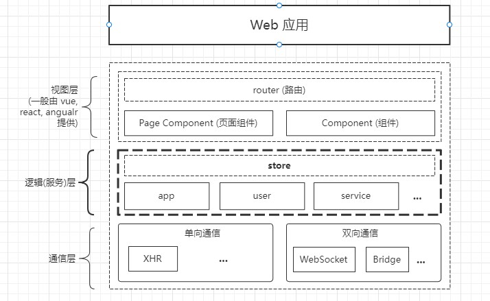

# 写在前面

::: tip

使用工具前, 首先要思考你要去解决什么样的问题。 建议, 根据问题去找方案, 不要盲目地选择工具.

:::

## 什么是 Store?

顾名思义, 有`商店`, `仓库`的作用。 一般在项目中处理 **全局状态管理(组件间状态传递)**、**视图/服务解耦** 的问题, 同时也具备一定的**存储管理能力**。在`vuex`的定义中, `Store`是一种 **状态管理模式**, 通过状态驱动视图更新。

> ps: 以 vuex 的状态模型举例

vuex 中, 将 Store 解释为一种是一种[状态管理模式](https://vuex.vuejs.org/#what-is-a-state-management-pattern), 解决的是 `视图 - 状态 - 行为` 三者之间的数据模型定义和状态流转问题.

不过在当前的前端环境下, 除了处理视图逻辑外, 也一定程度上承担了逻辑计算的业务。比如: 支付流程。所以, Store 从另外一方面来看, 也去承载了前端**对于业务逻辑的抽象行为**。

总结下, Store 的能力构成:

-   服务抽象 - 负责处理逻辑(服务)层中的业务抽象行为
-   状态管理 - 负责解决全局状态的存储和维护问题, 处理组件间的数据流转问题.
-   扩展 - 基于 Store 扩展 `持久化`, `orm映射` 等能力.

## Store 在前端应用中的定位

这是我常用的一个应用架构模型, 可以套入到 `vue`, `react`,`小程序`等多种应用场景. 理念跟其他的基于工具集方式的框架组合(喂饭式框架)不同。希望通过给定一个范围, 然后再根据实际情况, 去通过不同的工具组合来解决问题.

`视图层`, `通信层` 可以对应到常用的通过`vue`,`axios` 等工具组合成的前端应用. 这里主要探讨`逻辑(服务)层`. 以及`Store` 和 `逻辑层`的关系.

首先来解释下`逻辑层` 的定义, 这个概念主要借鉴 java 的分层设计(`controller`, `service`, `dao`). 将前端复杂的数据操作行为, 从视图组件中抽象出来. 从而使各部分功能独立且具备原子性。简单来说, 由`视图层`处理渲染和用户交互行为. `逻辑层`处理业务和数据操作.

针对**行为抽象**观点来说, **Store 是一种实现方式, 用来处理逻辑层抽象问题**, 假设我们不需要是状态(state)具备响应式特性, 那么简单的通过`class`来组织`逻辑层`代码也不失为一个不错的选择。这里具体的就仁者见仁智者见智了。
